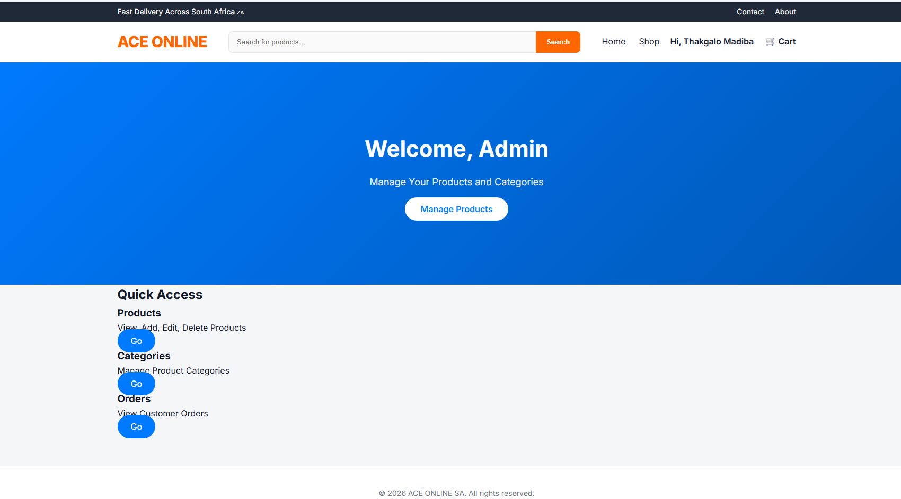
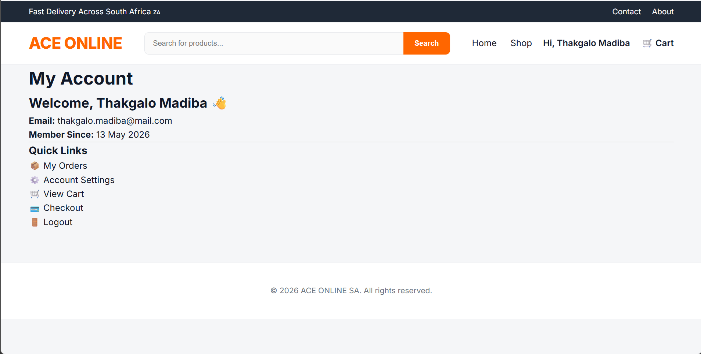
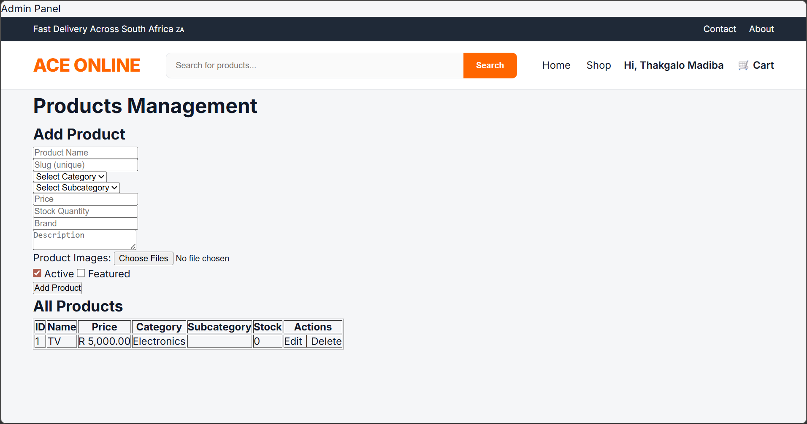

# Ace Online — Full-Stack E-Commerce Platform

A production-grade e-commerce platform built with PHP, MySQL, HTML, CSS, and vanilla JavaScript. Features a complete shopping experience for customers and a full management dashboard for administrators.

## 🚀 Live Demo

Coming soon — deployment in progress

---

## 📸 Screenshots






---

## ✨ Features

**Customer Side**
- Browse products by category and subcategory
- Featured products on homepage
- Full shopping cart (add, update, remove items)
- Secure checkout and order placement
- Order history and tracking
- Account registration and login

**Admin Dashboard**
- Product management — add, edit, delete products with images
- Category and subcategory management
- Order management — view and update order statuses
- Inventory tracking with stock control
- Customer account management
- Separate admin and customer views

**Security**
- Password hashing with `password_hash()` and `password_verify()`
- Prepared statements throughout — no SQL injection vulnerabilities
- XSS prevention using `htmlspecialchars()` on all output
- Session regeneration on login — prevents session fixation attacks
- Role-based access control — admin pages protected by auth guard

---

## 🛠️ Tech Stack

| Layer      | Technology                        |
|------------|-----------------------------------|
| Frontend   | HTML, CSS, Vanilla JavaScript     |
| Backend    | PHP                               |
| Database   | MySQL                             |
| Server     | Apache (XAMPP)                    |

---

## 🗄️ Database Schema

Key tables:
- `customers` — user accounts with role-based access
- `products` — product listings with slugs, brands, and featured flags
- `product_images` — multiple images per product
- `categories` / `subcategories` — hierarchical product organisation
- `cart` / `cart_items` — persistent shopping cart
- `orders` / `order_items` — order tracking with unique order numbers
- `addresses` — customer delivery addresses

---

## ⚙️ Setup & Installation

### Requirements
- PHP 7.4+
- MySQL 5.7+
- Apache (XAMPP recommended)

### Steps

**1. Clone the repository**
```bash
git clone https://github.com/thakgalomadiba/AceOnlineredesign.git
cd AceOnlineredesign
```

**2. Import the database**
- Open phpMyAdmin or MySQL Workbench
- Create a new database called `ace_online_v2`
- Import `database/ace_online_v2.sql`

**3. Configure the database connection**
- Open `public/partials/db.php`
- Update with your database credentials:

```php
$servername = "localhost";
$username   = "root";
$password   = "";
$dbname     = "ace_online_v2";
```

**4. Run the project**
- Place the project folder in your `htdocs` directory
- Start Apache and MySQL in XAMPP
- Visit `http://localhost/AceOnlineredesign`

### Default Admin Account
| Field    | Value                  |
|----------|------------------------|
| Email    | admin@aceonline.com    |
| Password | admin123               |

> ⚠️ Change these credentials immediately after setup.

---

## 📁 Project Structure

AceOnlineredesign/
├── admin/                        # Admin dashboard pages
│   ├── products.php
│   ├── orders.php
│   ├── categories.php
│   └── index.php
├── account/                      # Customer account pages
│   ├── dashboard.php
│   ├── orders.php
│   └── settings.php
├── public/
│   ├── assets/
│   │   ├── css/                  # Stylesheets (base, components, pages)
│   │   ├── js/                   # JavaScript files
│   │   └── images/               # Static images
│   ├── partials/                 # Reusable components (header, footer, db)
│   └── uploads/                  # User-uploaded product images
├── database/
│   └── ace_online_v2.sql         # Full database schema
├── index.php                     # Homepage
├── products.php                  # Product listing
├── product.php                   # Product detail
├── cart.php
├── checkout.php
├── login.php
├── register.php
└── logout.php

---

## 🔒 Security Highlights

- **SQL Injection Prevention** — All database queries use prepared statements with bound parameters
- **XSS Prevention** — All user-generated content sanitised with `htmlspecialchars()` before output
- **Secure Password Storage** — Passwords hashed using PHP's `password_hash()` with bcrypt
- **Session Security** — `session_regenerate_id(true)` called on every login
- **Role-Based Access Control** — All admin pages protected by an auth guard that checks session role before rendering

---

## 🗺️ Roadmap

- [ ] Deploy to live hosting
- [ ] Stripe / PayFast payment integration
- [ ] Email order confirmations
- [ ] Product search and filtering
- [ ] Mobile responsive improvements

---

## 👨‍💻 Author

**Thakgalo Makitla Madiba**

- GitHub: [@thakgalomadiba](https://github.com/thakgalomadiba)
- LinkedIn: [Thakgalo Madiba](https://linkedin.com/in/thakgalomadiba)
- Email: Thakgalomadiba08@gmail.com
